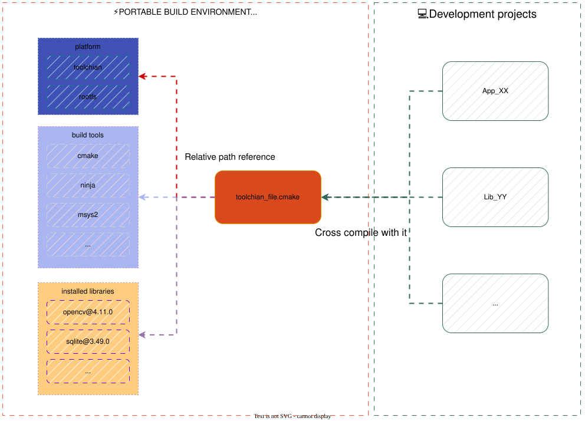

<div align="center">

# Celer

A lightweight, non-intrusive C/C++ package manager for engineering delivery, aimed at CMake-first projects.

[](https://opensource.org/licenses/MIT)
[](https://goreportcard.com/report/github.com/celer-pkg/celer)
[](https://github.com/celer-pkg/celer/releases)

[English](../../README.md) | [🌍 中文](../zh-CN/README.md)

</div>

---

Celer installs, builds, and caches C/C++ libraries — isolated by platform × project × build type.  
The same libraries can be built for Windows MSVC, Linux aarch64, and QNX without versions leaking across targets.  
Your CMake project stays unchanged. Celer generates a `toolchain_file.cmake` outside the tree and injects the toolchain, dependencies, and flags. Hand that file to a teammate or CI and the build environment goes with it.

## 🚀 30-second start

Download a binary from [Releases](https://github.com/celer-pkg/celer/releases), or `git clone` and `go build`.

```bash
# Example config repo — swap in your team's conf
celer init --url=https://github.com/celer-pkg/test-conf.git

# Pick a platform and project (one platform.toml = toolchain + sysroot)
celer configure --platform=x86_64-linux-ubuntu-22.04-gcc-11.5.0
celer configure --project=project_test_01

# Install a dependency, switch to aarch64 / Windows / QNX by changing --platform
celer install glog@0.6.0
```

Then in your own project:

```bash
cmake -B build -DCMAKE_TOOLCHAIN_FILE=<toolchain_file.cmake from Celer>
cmake --build build
```

📖 [Full quick start](./quick_start.md) · [Why Celer?](./why_celer.md)

## 💡 Non-intrusive: the project does not change



Dependencies, platforms, and compiler flags live in Celer's conf — not in your application repo.

- Keep your existing CMake layout; no recipe rewrite for the package manager
- Switch targets by swapping a `platform.toml`, not rewriting CLI flags and profiles
- The generated toolchain file travels on its own — CI, handoff, and bug reproduction use the same file

## 🎯 Who this is for

- You ship one product across **Windows / Linux / embedded** with **MSVC, GCC, and Clang**
- You need a **reproducible build** for teammates or CI, not "works on my machine"
- You distribute **private binaries** or run an internal artifact store
- Several projects share a machine and you are done with dependency versions colliding

If you only want a few open-source libraries on a laptop, [Conan](https://conan.io) / [vcpkg](https://vcpkg.io) / [XMake](https://xmake.io) are ready-made. Celer is for teams that put **cross-compilation, isolation, and delivery** first.

## 🌟 What you get

| When you need… | What Celer does |
| --- | --- |
| **Switch cross-compile targets** | One `platform.toml` holds toolchain, sysroot, and env vars — ARM / x86 / QNX / Windows / Linux |
| **Keep projects from colliding** | Isolate versions, macros, and CMake vars by platform × project × build type |
| **Mixed upstream build systems** | CMake, Makefiles, Meson, B2, QMake, Bazel, GYP |
| **Private / prebuilt libraries** | Hash-based artifact cache shared by the team and CI |
| **Flaky or restricted GitHub access** | Git repos of third-party libraries and tools you already fetched are cached |
| **Reproducible CI** | Export a workspace snapshot; the same config enters the pipeline |

MSVC / Clang / GCC are ready on Windows and Linux; macOS is still in progress. Additional targets (including QNX) are defined as platform configs.

## 📚 Documentation

**Get started in 5 minutes:**
- [Quick Start Guide](./quick_start.md) · [Init a Workspace](./quick_start.md#3-setup-conf)
- [Create a Platform / Project / Port](./cmd_create.md)
- [Install a Library](./cmd_install.md) · [Deploy](./cmd_deploy.md)

**Deep dives:**
- [Generate CMake Config Files](./article_generate_cmake_config.md)
- [Platform Config Deep Dive](./article_platform.md) · [Port Config Deep Dive](./article_port.md) · [Project Config Deep Dive](./article_project.md)
- [PkgCache: Shared Cache (fs / MinIO)](./article_pkgcache.md) · [Artifact Cache](./article_pkgcache_artifacts.md) · [Repo Cache](./article_pkgcache_repos.md) · [Download Cache](./article_pkgcache_downloads.md)
- [CCache Integration](./article_ccache.md)
- [CUDA Auto-detection](./article_cuda_support.md)
- [Expression Variables](./article_expvars.md)
- [Dependency Conflict Detection](./article_detect_conflict_circular.md)
- [Python Version Management](./article_python_management.md)
- [Build Tools](./article_build_tools.md)
- [Export Snapshots](./cmd_deploy_snapshot.md)

**Reference:**
- [configure](./cmd_configure.md) · [install](./cmd_install.md) · [remove](./cmd_remove.md) · [update](./cmd_update.md) · [search](./cmd_search.md) · [tree](./cmd_tree.md) · [clean](./cmd_clean.md) · [autoremove](./cmd_autoremove.md) · [reverse](./cmd_reverse.md) · [integrate](./cmd_integrate.md) · [version](./cmd_version.md)

## 🤝 Contributing

Contributions are welcome in both the core and ports:

- **[celer](https://github.com/celer-pkg/celer)** — core package manager
- **[ports](https://github.com/celer-pkg/ports)** — port definitions & build configs

## 📄 License

MIT. See [LICENSE](../../LICENSE). Third-party libraries in `ports/` remain under their original licenses.

---

<div align="center">

**A C/C++ package manager: don't change the project. Make cross-compilation a toolchain file you can ship.**

[⭐ Star us on GitHub](https://github.com/celer-pkg/celer) | [📖 Documentation](./quick_start.md) | [🐛 Report Issues](https://github.com/celer-pkg/celer/issues)

</div>
